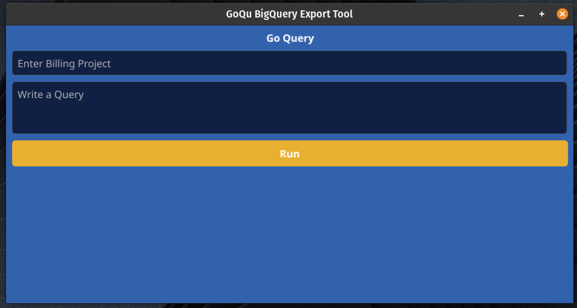

# GoQuery 
## Golang BigQuery Export Tool

### Mac Users
- Download the GoQuery.zip file and unzip, located in release found in releases. (_Work In Progress_)

### Windows Users
- Download the GoQuery.exe file found in releases. (_Work in Progress_)

# Guide for Use
Export your complete Query result to a CSV file, quickly and efficiently. Authentication is handled using OAuth 2.0 via browser authentication.

### Use
Input your query as a string, as well as the billing project ID that will be used to bill for compute resources consumed by the query. 

## ToDo Feature List
- Query error parsing
- Syntax highlighting

